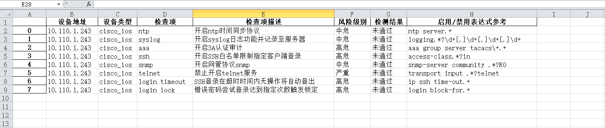
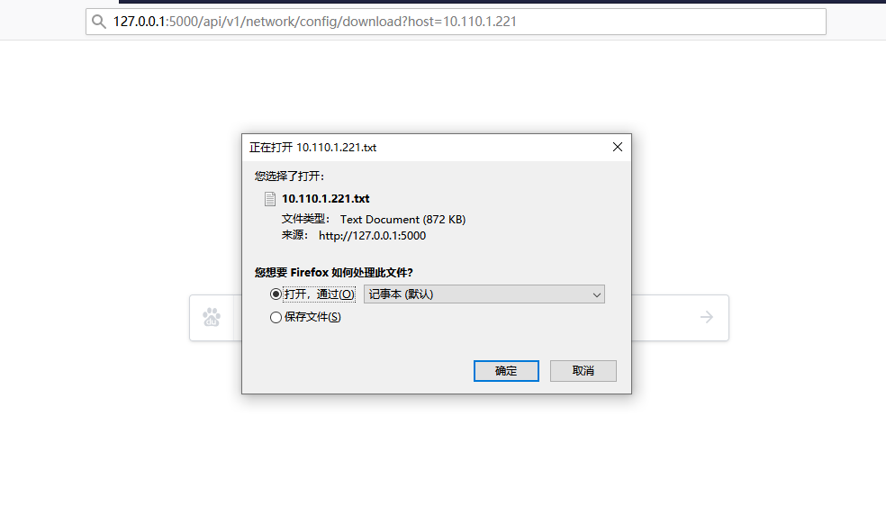
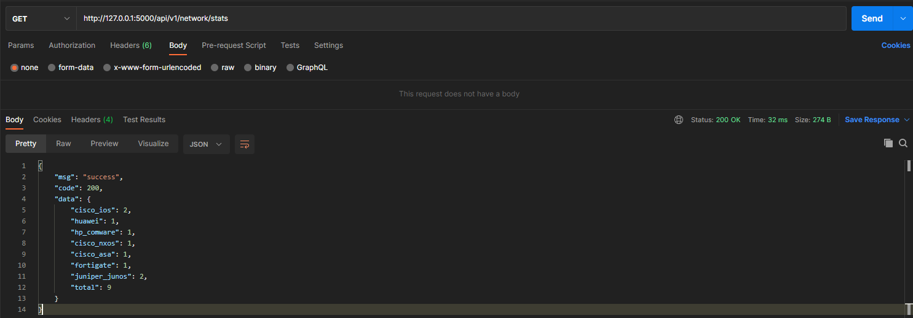

# 基于fastapi实现简单网络自动化后端服务

- 为了方便安装部署，尽量减少外部中间件的引入，如数据库、缓存等，如果需要持久化存储对接内部平台，则自行引入
- config.toml作为项目配置文件，包括设备的相关所需信息(管理地址、账号、密码、设备类型、备份路径...)

## 安装（虚拟环境或docker）

- 虚拟环境
```bash
pip install virtualenv 
virtualenv venv --python=python3.8
source venv/bin/activate
git clone git@github.com:xxddpac/netdev.git
cd netdev
pip install -r requirements.txt -i https://pypi.douban.com/simple/
python main.py
```

- Docker(确保已安装docker)
```bash
git clone git@github.com:xxddpac/netdev.git
cd netdev
docker build -t netdev .
docker images
docker run -d -p 5000:5000 -v /data/network:/data/network -v /var/log:/var/log --name 'networkAutomationServiceWithFastapi' netdev
docker ps -a
```

## 验证
```bash
curl http://X.X.X.X:5000/api/v1/ping

# 返回 {'msg': 'success', 'code': 200, 'data': 'pong'} 说明服务已正常启动
```

## 支持功能

- 实现全网多种类型设备配置备份(思科、华为、华三、飞塔、山石、Juniper...)
- 备份任务通知(企业微信、邮件)，展示任务执行详情(设备总数、执行失败数、执行失败列表)
- 安全基线扫描(针对不同类型设备定义安全扫描项，快速输出基线扫描结果应对合规检查要求)
- 配置历史对比(根据不同日期备份配置展示差异)
- 配置下载、配置查询等其他API服务
- 设备类型统计

## 功能展示

- (手动)触发异步备份任务
```bash
curl http://X.X.X.X:5000/api/v1/network/config/backup

```

- (计划任务每天)触发异步备份任务
```bash
40 0 * * * curl http://X.X.X.X:5000/api/v1/network/config/backup

```

- 触发异步基线扫描任务(扫描结果.xlsx存放baseline文件夹下)
```bash
curl http://X.X.X.X:5000/api/v1/network/baseline/check
```

- 查询备份成功设备详情


- 查询指定设备最新配置


- 指定日期获取配置差异


- 备份任务通知


- 安全基线扫描



- 最新配置下载



- 设备类型统计

