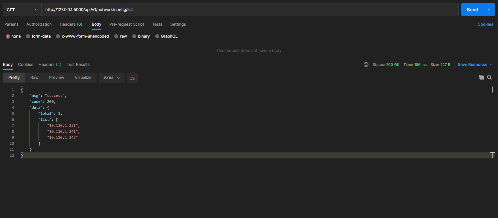
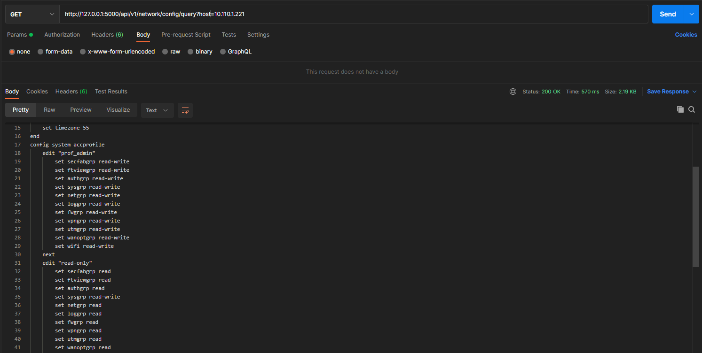
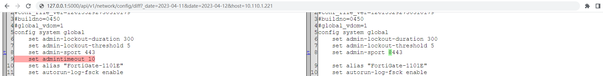

# 基于fastapi实现的简单网络自动化后端服务


## 支持功能

- 实现全网多种类型设备配置备份(思科、华为、华三、飞塔、山石...)
- 备份任务通知(企业微信、邮件)，展示任务执行详情(设备IP总数、执行失败IP数、执行失败IP列表) TODO
- 安全基线扫描(针对不同类型设备定义安全扫描项，快速输出基线扫描结果应对合规检查要求) TODO
- 配置历史对比(根据不同日期备份配置展示差异对比)
- 配置下载、配置查询等其他API服务

## 部分功能展示
- (手动)触发异步备份任务
```bash
curl http://127.0.0.1:5000/api/v1/network/config/backup

```
- (计划任务，每天凌晨0点40)触发异步备份任务(推荐)
```bash
40 0 * * * curl http://127.0.0.1:5000/api/v1/network/config/backup

```
- 查询备份成功设备详情



- 查询指定设备最新IP配置


- 指定日期获取配置差异
